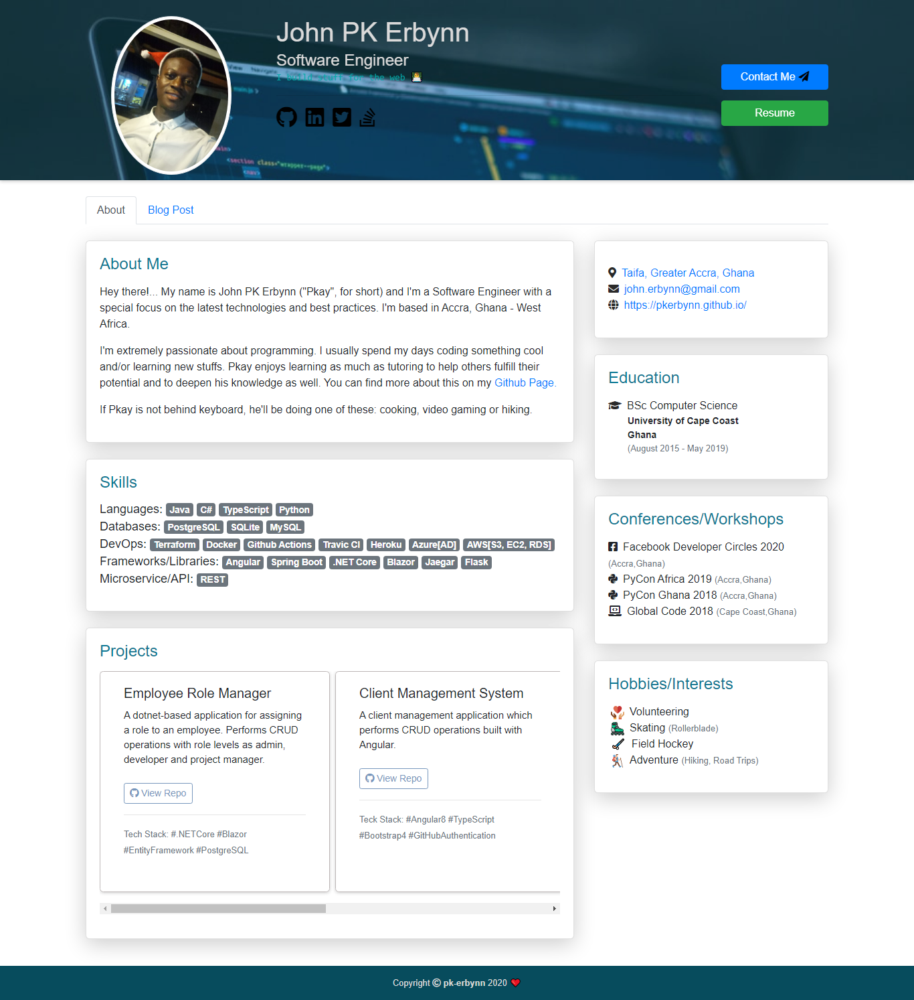

# pkerbynn.github.io
This is my personal website/portfolio with all the relevant information about me :blush:

[Demo](https://www.pkerbynn.github.io)

## Table of contents
- General info
- Screenshots
- Features
- Technologies
- Setup
- Status
- Inspiration
- Contact
- Contributing

## General info
My portfolio webiste with having projects, education history and other relevant information about me.

## Screenshots


## Features
- About Me
- Blog Posts
- Skills/Tools
- Open Source Projects
- Education
- Contact 
- Conferences
- Hobbies & Interests

## Technologies
- HTML5
- CSS3
- Bootstrap 4
- Font Awesome
- Github Pages

## Usage
### Requirements
- Working Laptop
- Text Editor [VS code]
- Web Browser [Chrome, Firefox]
- Git [optional]

### Setup
1 Clone this repository
  ```
  $ git clone https://github.com/pkerbynn/pkerbynn.github.io
  ```
2 Navigate into the directory 
  ```
  $ cd /pkerbynn.github.io.git
  ```
3 Double click to open **index.html** file

## Status
Project is: in progress

## Inspiration
This project is to improve my online presence.

## Contact
This project was created by [PK Erbynns](john.erbynn@gmail.com) - feel free to contact me!
   
## Contributing
- Fork it (https://github.com/pkerbynn/pkerbynn.github.io)
- Create your feature branch (git checkout -b MY_BRANCH_NAME)
- Make changes and commit (git commit -am 'Add some fooBar')
- Push to the branch (git push origin MY_BRANCH_NAME)
- Create a new **Pull Request**
